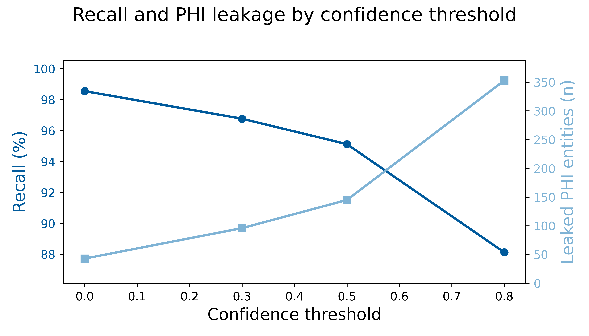

# ASQ-PHI: Adversarial Synthetic Queries for PHI

**ASQ-PHI** (Adversarial Synthetic Queries for Protected Health Information de-identification) is a benchmark dataset of **1,051 fully synthetic clinical search queries** designed to stress test HIPAA-compliant de-identification software.

This is the **first benchmark to test both safety (PHI removal) AND utility (clinical meaning preservation)** on search queries, targeting the "safe handoff" problem in clinical LLM workflows.

> **Important note:** All content is 100% synthetic. No real patient data were used.

---

## The Problem: Safe Handoff from HIPAA BAA LLMs

Hospitals are beginning to deploy HIPAA-compliant Business Associate Agreement (BAA) large language models (LLMs). In the public setting, LLMs with fixed training cutoffs are routinely augmented with tools such as web search, deep research, and Model Context Protocol (MCP) servers so they can reach up-to-date knowledge. BAA LLMs, by contrast, almost never expose live web search or external tools, even though clinicians expect LLMs to surface current guidelines, drug safety updates, and literature. The constraint is that any query leaving a BAA-protected LLM for an external service must be free of Protected Health Information (PHI). We refer to this boundary as the safe handoff: the moment when a clinician’s PHI-containing query, generated inside a HIPAA-compliant BAA LLM, must be transformed into a HIPAA Safe Harbor–compliant version before being sent to non-BAA tools such as web search APIs, external evidence services, or MCP servers. Existing de-identification datasets are built from long electronic health record narratives rather than the short, compressed search queries clinicians type into LLM chat interfaces, so they do not allow de-identification performance to be tested at this safe handoff. ASQ-PHI (Adversarial Synthetic Queries for Protected Health Information de-identification) is constructed to supply this missing data: a benchmark of 1,051 fully synthetic clinical search queries with ground-truth PHI annotations for stress-testing HIPAA-compliant de-identification software. All queries were generated using Azure OpenAI GPT-4o. No real patient data were used.

## Research hypothesis:

Current de-identification systems fail at the safe handoff from LLMs running inside HIPAA BAAs to external tools in two ways:

1) Leaking PHI

2) Over-redacting non-identifying clinical information reducing query utility.

### Example: The Age Problem

Many systems flag "18-year-old female" as PHI and redact the age, despite **age <90 being explicitly non-identifying under Safe Harbor**.

**Original query:**
```
Bleeding recommendations for 18-year-old female with iron deficiency anemia
```

**After over-aggressive de-identification:**
```
Bleeding recommendations for [AGE] female with iron deficiency anemia
```

**Result:** Clinically less usefull. Search returns less specific results for adolescent female specific guidance.

ASQ-PHI measures this utility-erosion behavior with **219 hard negative queries** containing zero PHI but mimicking PHI structure.

---

## Repository Structure

```
/
├── code/
│   ├── .env.example                     # Template for Azure OpenAI credentials
│   └── data_generation_pipeline.ipynb   # Notebook for generating ASQ-PHI
├── data/
│   ├── synthetic_clinical_queries.txt   # The core ASQ-PHI dataset (1,051 queries)
│   └── dataset_statistics.txt           # Metadata and distribution stats
├── figures/                             # Descriptive and validation figures (Figs 1-6)
│   ├── fig1_data_structure_example.png
│   ├── fig2_phi_type_distribution.png
│   ├── fig3_dataset_composition.png
│   ├── fig4_phi_density_distribution.png
│   ├── fig5_leakage_recall_baseline.png
│   └── fig6_overredaction_baseline.png
├── validation_results/                  # Baseline metrics for Amazon Comprehend Medical
│   ├── positive_metrics_by_threshold.csv
│   └── negative_metrics_by_threshold.csv
├── requirements.txt                     # Python dependencies
├── LICENSE
└── README.md
```

---

## Dataset Overview

### File Format

`data/synthetic_clinical_queries.txt` contains **1,051 clinical search queries** using a delimiter-based format:


**PHI annotations** follow HIPAA Safe Harbor categories: NAME, GEOGRAPHIC_LOCATION, DATE, MEDICAL_RECORD_NUMBER, HEALTH_PLAN_BENEFICIARY_NUMBER, PHONE_NUMBER, SOCIAL_SECURITY_NUMBER, EMAIL_ADDRESS, etc.

**Clinical context** (age <90, diagnoses like "COPD", medications, symptoms) is **intentionally not labeled as PHI** to enable over-redaction measurement.

### Composition


- **832 PHI-positive queries (79.2%)**: Contain 1-5 HIPAA identifiers (mean 3.57, median 4.0)
- **219 hard negatives (20.8%)**: Zero PHI, adversarial structure
- **2,973 total PHI elements** across 13 identifier types


**Top 3 identifier types:**
- GEOGRAPHIC_LOCATION: 826 (27.8%)
- NAME: 814 (27.4%)
- DATE: 806 (27.1%)


See `data/dataset_statistics.txt` for full distribution.

---

## Baseline Validation Results

We tested ASQ-PHI using **Amazon Comprehend Medical (DetectPHI)** across confidence thresholds (0.0 to 0.8). Results demonstrate severe recall-utility tradeoffs:

| Threshold | Recall | Leaked PHI | Over-redaction (Hard Negatives) |
|-----------|--------|------------|----------------------------------|
| 0.0       | 98.7%  | 47 elements | 90.0% |
| 0.3       | 96.8%  | 96 elements | 89.6% |
| 0.5       | 95.2%  | 143 elements | 88.4% |
| 0.8       | 88.1%  | 351 elements | 86.8% |

**Key finding:** Even at maximum sensitivity (threshold 0.0), the system leaks 47 PHI elements. At clinical utility-preserving thresholds (0.8), **351 PHI elements leak** while still over-redacting 86.8% of hard negatives.




These results characterize ASQ-PHI's difficulty and confirm it identifies edge cases not captured by EHR-trained models.

---

## Quick Start

### Installation

```bash
pip install -r requirements.txt
```

### Reproducing the Dataset

To generate new synthetic queries using the same adversarial pipeline:

1. **Configure Azure OpenAI credentials** (copy `.env.example` to `.env`):
   ```bash
   AZURE_OPENAI_API_KEY_4o=your_key
   AZURE_OPENAI_ENDPOINT_4o=your_endpoint
   AZURE_OPENAI_DEPLOYMENT_4o=your_deployment
   ```

2. **Run the notebook:**
   ```bash
   jupyter notebook code/data_generation_pipeline.ipynb
   ```

3. **Customize for domain-specific variants:**
   - Edit the few-shot examples in the system prompt cell
   - Adjust PHI type distributions or density targets
   - Generate oncology-focused, cardiology-focused, or pediatrics-focused variants

---

## Use Cases

ASQ-PHI is designed for:

- **Healthcare AI developers**: Test de-identification layers before deploying LLM-powered clinical decision support with external tools
- **MCP server developers**: Validate HIPAA-compliant tool integrations for clinical LLM workflows
- **Web search API providers**: Benchmark PHI detection in real-time query filtering
- **Privacy researchers**: Develop and test novel de-identification algorithms on adversarial queries
- **Compliance teams**: Evaluate vendor claims about HIPAA-compliant external tool integrations

---

## Extending ASQ-PHI: Fork and Generate Your Own Dataset

Most teams need a domain-specific, regulation-specific safe-handoff benchmark but do not have time to design one from scratch. ASQ-PHI is therefore built as a **template**: you keep the data format, validators, and evaluation code, and you swap in your own language, regulation, and clinical setting.

### What you can change

By forking this repo and editing a single notebook, you can generate variants that differ in:

- **Language**  
  e.g. English, Spanish, French, German.

- **Regulatory framework / PHI schema**  
  HIPAA Safe Harbor, GDPR-style identifiers, national ID schemes, or an internal PHI/PII list.

- **Clinical specialty and setting**  
  Oncology, cardiology, pediatrics, psychiatry, radiology, ICU, primary care, etc.

- **Prompting / query style**  
  Short LLM chat prompts, order-entry text, triage descriptions, internal ticket text, tool-calling prompts.

- **Model**  
  GPT-4o / GPT-4.1, other hosted models, or local/open-weight models.

All variants still use the same `QUERY` / `PHI_TAGS` structure and the same evaluation metrics, so results remain comparable.

---

### Minimal steps to create a new variant

#### 1. Fork and duplicate the pipeline
- Fork this repo to your GitHub organization.
- Copy `code/data_generation_pipeline.ipynb` and rename it (e.g. `data_generation_oncology_es.ipynb`).

#### 2. Edit the system prompt (this is the main change)
- Switch to your target **language**.  
- Describe your **clinical setting** and **question style**.  
- List the **identifier types** you want the model to emit.  
- **Do not change** the output structure:

===QUERY===

===PHI_TAGS===
{"identifier_type": "...", "value": "..."}

#### 3. Update the identifier schema if needed
- In the notebook, adjust the allowed `identifier_type` values  
  (for example add `NATIONAL_ID`, `HOSPITAL_NAME`, `POSTAL_CODE`, etc.).
- The existing validation code will enforce this schema and reject malformed examples.

#### 4. Point to your model and run
- Change the client config to your chosen model (GPT-4o, Claude, MedLM, local LLM, …).
- Run the notebook to:
  - Generate synthetic queries + PHI tags  
  - Validate JSON and span alignment  
  - Ensure hard negatives contain **zero** identifiers  
  - Export a cleaned dataset + summary statistics

#### 5. Name and document your dataset
- Examples: `ASQ-PHI-Oncology`, `ASQ-PHI-ES-GDPR`, `ASQ-PHI-Pediatrics-Triage`.  
- In your README or paper, state the **language**, **regulation**, **specialty**, and **query style**.

---

### Why this is worth your time

Forking ASQ-PHI instead of building a new pipeline gives you:

- A **ready-made, tested** safe-handoff framework that never touches real patient data.
- Region- and specialty-specific benchmarks that still share a **common format and metrics**, enabling fair comparison.
- A clear, **auditable** story for privacy and compliance teams: how data was generated, which identifiers were included, and how hard negatives were constructed.

ASQ-PHI is meant to be a **base layer**, not a one-off dataset.  
Fork it, adapt it to your regulatory and clinical reality, and use the same framework to stress-test your own de-identification system at the BAA safe-handoff boundary.

---

## Citation

If you use ASQ-PHI for benchmarking or research, please cite:

```bibtex
@dataset{weatherhead2025asqphi,
  title={ASQ-PHI: An Adversarial Synthetic Benchmark for Clinical De-Identification and Search Utility},
  author={Weatherhead, James},
  year={2025},
  publisher={Mendeley Data},
  version={V1},
  doi={10.17632/csz5dzp7nx.1}
}
```

**Mendeley Data:** https://doi.org/10.17632/csz5dzp7nx.1

---

## License

**MIT License.** This dataset is fully synthetic and open for academic and commercial use.

---

## Contact

**James Weatherhead**  
MD-PhD Student, Automated Science Track  
University of Texas Medical Branch at Galveston  
jacweath@utmb.edu

---

## Acknowledgments

Dataset generated using Azure OpenAI GPT-4o. Baseline validation performed using Amazon Comprehend Medical (DetectPHI). All content is synthetic; no real patient data were used in creation or validation.
